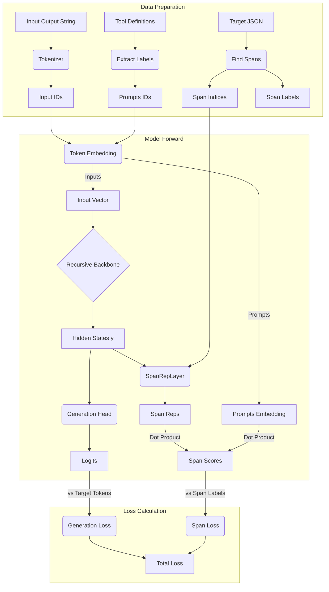

# Hướng dẫn Tích hợp GLiNER vào TinyRecursiveModel

Tài liệu này giải thích chi tiết về luồng dữ liệu (Data Flow) khi Training và Inference với kiến trúc TinyRecursiveModel đã được tích hợp module trích xuất span của GLiNER.

## 1. Luồng dữ liệu khi Training (Huấn luyện)

Trong quá trình training, chúng ta sử dụng phương pháp **Hybrid Learning**: kết hợp sinh từ tiếp theo (Generation) và trích xuất thực thể (Extraction).

### Quy trình từng bước:

1.  **Chuẩn bị Dữ liệu (`src/dataset.py`):**
    *   **Classes (Prompts)**: Dataset tự động trích xuất danh sách tên các argument từ định nghĩa tools (ví dụ: `symbol`, `start_date`, `chain_slug`). Các tên này được tokenize thành `prompts_ids`.
    *   **Input IDs**: Ghép nối các thành phần thành chuỗi token duy nhất:
        `[System Prompt] + [Tool Definitions] + [User Query] + [Expected JSON Output]`
    *   **Spans (Targets)**: Dataset phân tích chuỗi JSON output mong muốn để tìm vị trí của các giá trị argument.
        *   Ví dụ: Nếu giá trị là "AAPL" và nó nằm ở token thứ 45 đến 46 trong tổng chuỗi input.
        *   -> `span_idx` = `[[45, 46]]`.
        *   -> `span_labels` = ID của lớp "symbol".

2.  **Forward Pass (`src/model.py`):**
    *   **Bước 1: Embedding**:
        *   `input_ids` -> đi qua Token Embedding -> Vector Input.
        *   `prompts_ids` -> đi qua Token Embedding -> lấy trung bình -> `prompts_embedding` (Vector đại diện cho mỗi loại argument).
    *   **Bước 2: Recursive Backbone**: Vector Input đi qua các lớp đệ quy (Recursive Blocks), tạo ra chuỗi Hidden States `y` có kích thước `[Batch, SeqLen, HiddenSize]`. Vector `y` chứa thông tin ngữ cảnh phong phú.
    *   **Bước 3: Generation Head**: Vector `y` đi qua lớp Linear để dự đoán từ tiếp theo -> Tạo ra `logits`. (Dùng cho Generation Loss).
    *   **Bước 4: GLiNER Module (Extraction)**:
        *   Model trích xuất các vector từ `y` tại các vị trí được chỉ định bởi `span_idx`.
        *   Các vector này đi qua `SpanRepLayer` (MLP) để tạo thành `span_rep`.
        *   Thực hiện phép nhân vô hướng (Dot Product) giữa `span_rep` và `prompts_embedding`.
        *   -> Tạo ra `span_scores`: Xác suất của mỗi span thuộc về loại argument nào.

3.  **Tính Loss (`src/trainer.py`):**
    *   **Generation Loss**: CrossEntropy giữa từ dự đoán và từ thực tế (để model học cách sinh JSON đúng cú pháp).
    *   **Span Loss**: CrossEntropy giữa loại argument dự đoán và nhãn thực tế (để model "hiểu" ý nghĩa của giá trị nó sinh ra).
    *   **Tổng hợp**: `Total Loss = Generation Loss + Span Loss`.

---

## 2. Luồng dữ liệu khi Inference (Sử dụng)

Khi inference, chúng ta không có `span_idx` trước (vì chưa biết output là gì). Có hai chiến lược sử dụng:

### Cách 1: Pure Generation (Sinh văn bản thuần túy)
Model hoạt động như một LLM, nhưng thông minh hơn nhờ quá trình training hybrid.
1.  **Input**: User Query + Tool Definitions.
2.  **Process**: Model chạy vòng lặp sinh từ (`model.generate`) tự động.
3.  **Output**: Model sinh ra chuỗi JSON `<tool_call> {"symbol": "AAPL"} ...`.
    *   *Lợi ích*: Do đã được train với Span Loss, các tham số của model đã học được mối liên kết mạnh mẽ giữa ngữ cảnh và loại thực thể, giúp giảm thiểu việc sinh sai tên argument hoặc sai giá trị.

### Cách 2: Generation + Verification (Sinh và Kiểm chứng)
Dùng để tăng độ tin cậy.
1.  **Generate**: Để model sinh ra chuỗi JSON output như Cách 1.
2.  **Parse & Locate**: Dùng code (regex/json parser) để tìm vị trí các giá trị argument trong chuỗi vừa sinh ra (ví dụ: tìm thấy "AAPL" ở vị trí 50-51).
3.  **Verify**: Gọi model một lần nữa (Forward pass) truyền vào `span_idx=[[50, 51]]` và `prompts_embedding`.
4.  **Check**: Xem `span_scores`. Nếu model gán điểm thấp cho nhãn "symbol" tại vị trí đó, có thể đánh dấu là nghi ngờ (low confidence) để xử lý thêm.

---

## 3. Chi tiết Xử lý Dataset

*(Các bước chi tiết đã được mô tả ở trên, phần này tổng hợp lại các thành phần chính)*
- **Input Composition**: System + Tools + User + Assistant Response.
- **Span Finding**: Sử dụng Character Offset Mapping để ánh xạ chính xác từ ký tự trong JSON value sang Token Index trong `input_ids`.

---

## 4. Giải thích Chi tiết Input (Ví dụ Minh họa)

Giả sử chúng ta có một mẫu dữ liệu với công cụ `web_chain_details` có tham số `chain_slug`, và model sinh ra đoạn JSON gọi hàm: `{"chain_slug": "ethereum"}`.

### `input_ids`
Là chuỗi số đại diện cho toàn bộ văn bản đầu vào.
- Ví dụ: `[1, 523, ..., 89, 250, 401, ..., 2]`
- Trong đó, từ **"ethereum"** nằm ở token thứ **250**.

### `span_idx` (Vị trí Span)
Là tọa độ của giá trị argument trong chuỗi `input_ids`.
- **Định dạng**: `[Start_Index, End_Index]` (Inclusive - Bao gồm cả 2 đầu).
- **Ví dụ**: `[250, 250]`
    - Nghĩa là giá trị cần trích xuất bắt đầu ở token 250 và kết thúc ở token 250 (gói gọn trong 1 token).
    - Nếu giá trị là "smart contract" (2 tokens: `smart` tại 300, `contract` tại 301), thì `span_idx` sẽ là `[300, 301]`.

### `span_labels` (Nhãn của Span)
Là ID của tên loại argument (Class ID).
- **Ví dụ**: `1`.
- ID này trỏ đến danh sách Prompts. Số 1 nghĩa là loại tham số thứ 2 trong danh sách (Index 1).

### `prompts_ids` (Danh sách Classes)
Là danh sách các tên argument được tokenize.
- **Ví dụ**:
    - Class 0 (`symbol`): `[197, 0, 0...]`
    - Class 1 (`chain_slug`): `[3323, 78, 7068...]`
- `span_labels = 1` ở trên sẽ khớp với dòng Class 1 (`chain_slug`).

---

## 5. Giải thích về `prompts_embedding`

### `prompts_embedding` là gì?
Là một **Vector đại diện (Prototype Vector)** cho mỗi loại nhãn (Class).
- Kích thước: `[Batch_Size, Num_Classes, Hidden_Size]`.
- Ví dụ: Nếu `Hidden_Size = 256`, thì `chain_slug` sẽ được ép nén thành một vector chứa 256 số thực.

### Tại sao phải lấy Trung bình cộng (Average)?
Tên của một argument (phần Class Name) thường bao gồm nhiều Token.
- Ví dụ: `chain_slug` -> Tokenizer tách thành 3 tokens: `chain` + `_` + `slug`.
- Mỗi token này có một vector embedding riêng: $v_{chain}, v_{\_}, v_{slug}$.

Tuy nhiên, module GLiNER cần so sánh **"vector của giá trị span"** (ví dụ vector của "ethereum") với **"vector của tên loại"** (ví dụ "chain_slug") để xem chúng có khớp nhau không (tương đồng ngữ nghĩa).
- Để so sánh 1-1, ta cần **một vector duy nhất** đại diện cho `chain_slug`.
- **Phương pháp Averaging**: Ta cộng 3 vector lại và chia 3: $v_{final} = \frac{v_{chain} + v_{\_} + v_{slug}}{3}$.
- Đây là cách đơn giản và hiệu quả nhất để tổng hợp ý nghĩa của cả cụm từ thành một điểm đại diện trong không gian vector.

### Quy trình so sánh (Inference Logic)
1. Model nhìn thấy span "ethereum" -> Tạo ra vector $v_{span}$.
2. Model nhìn thấy prompt "chain_slug" -> Tạo ra vector $v_{prompt}$ (bằng cách average).
3. Tính độ tương đồng: **Dot Product** $(v_{span} \cdot v_{prompt})$.
4. Nếu kết quả cao -> Model tự tin rằng "ethereum" là một "chain_slug".

---

## Sơ đồ Luồng Dữ liệu (Training)

